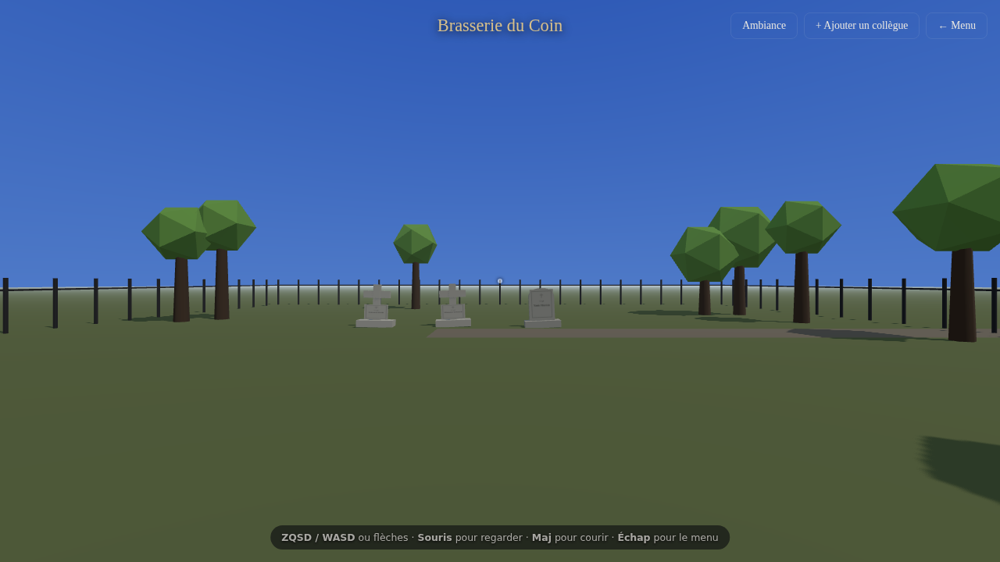

# ⚰️ Le Cimetière des Collègues

Une application web **3D** où l'on se balade à la première personne dans un
**cimetière**. Chaque **entreprise** a son propre cimetière, et chaque **tombe**
honore un·e collègue qui a quitté l'entreprise, accompagné·e de **sa citation**.

L'ambiance change selon **l'heure** et la **saison** — avec un mode spécial
**🎃 Halloween** qui transforme le lieu en cimetière effrayant.



## Stack technique

| Côté | Technologies |
| --- | --- |
| **Frontend** | Vite 8 · Three.js 0.185 · TypeScript 7 |
| **Backend** | Fastify 5 · Better Auth 1.6 · Drizzle ORM 0.45 |
| **Base de données** | PostgreSQL 18 |
| **Outils** | pnpm 10 (workspace) · Node 22 |

Mono-dépôt pnpm avec deux packages : [`server/`](server) (API) et [`web/`](web)
(client 3D).

## Prérequis

- Node ≥ 22, pnpm ≥ 10
- Docker (pour PostgreSQL 18) **ou** un PostgreSQL accessible

## Démarrage rapide

```bash
# 1. Dépendances
pnpm install

# 2. Base de données PostgreSQL 18
pnpm db:up                      # docker compose up -d db

# 3. Configuration du serveur
cp server/.env.example server/.env
#   puis renseignez BETTER_AUTH_SECRET (>= 32 caractères) :
#   openssl rand -base64 32

# 4. Schéma + données d'exemple
pnpm db:generate                # génère les migrations Drizzle
pnpm db:migrate                 # applique les migrations
pnpm seed                       # entreprises + collègues d'exemple

# 5. Lancement (API + client en parallèle)
pnpm dev
```

- Client : http://localhost:5173
- API : http://localhost:3000 (le client proxifie `/api` vers l'API)

## Utilisation

1. **Inscrivez-vous / connectez-vous** (comptes gérés par Better Auth).
2. **Choisissez un cimetière** dans le menu pour un *voyage rapide*, **ou** cliquez
   sur *🚶 Explorer la route des cimetières* pour vous promener sur la **route
   commune** : marchez jusqu'à un portail (enseigne nom / karma / statut) et
   appuyez sur **E** pour entrer. **F** pour saluer les autres visiteurs.
3. **Baladez-vous** :
   - `ZQSD` / `WASD` ou flèches pour marcher
   - **Souris** pour regarder (cliquez pour capturer le curseur)
   - **Maj** pour courir, **Échap** pour revenir au menu
4. **Approchez-vous d'une tombe** pour révéler le nom, la date de départ et la
   citation du collègue.
5. **Ajoutez un collègue** via le bouton dédié (nom, citation, date de départ).
6. **Changez l'ambiance** via le bouton *Ambiance* : moment de la journée,
   saison, ou mode 🎃 Halloween.

## Modèle de données

- `user` / `session` / `account` / `verification` — tables gérées par Better Auth.
- `companies` — un cimetière par entreprise (`name`, `slug`, `description`).
- `colleagues` — une tombe par collègue (`name`, `quote`, `departedOn`,
  `graveSeed` pour une forme/position déterministe, `vote_score` et `maintenance`
  pour les axes visuels ci-dessous).

Schéma défini avec Drizzle dans [`server/src/db`](server/src/db) ; migrations
versionnées dans `server/drizzle`.

## API

| Méthode | Route | Auth | Description |
| --- | --- | --- | --- |
| `*` | `/api/auth/*` | — | Better Auth (inscription, connexion, session) |
| `GET` | `/api/companies` | non | Liste des cimetières + nombre de tombes, karma et statut |
| `POST` | `/api/companies` | oui | Crée un cimetière |
| `GET` | `/api/companies/:id/colleagues` | non | Détail d'un cimetière + tombes |
| `POST` | `/api/companies/:id/colleagues` | oui | Ajoute une tombe |
| `GET` | `/api/rooms/:room/stream` | non | Flux SSE de présence d'un salon (#4) |
| `POST` | `/api/rooms/:room/state` | non | Publie sa position (relayée aux pairs) |
| `POST` | `/api/rooms/:room/emote` | non | Joue une emote (relayée aux pairs) |
| `POST` | `/api/rooms/:room/leave` | non | Quitte le salon (balise de fermeture) |

## Scripts utiles

```bash
pnpm dev            # API + client en parallèle
pnpm dev:host       # idem, mais client exposé sur le réseau (test multijoueur multi-appareils)
pnpm dev:server     # API seule
pnpm dev:web        # client seul
pnpm build          # build de production (client + serveur)
pnpm typecheck      # vérification de types (TypeScript 7 / tsgo)
pnpm db:up          # démarre PostgreSQL 18 (Docker)
pnpm db:down        # arrête PostgreSQL
pnpm test           # tests unitaires + intégration (Vitest, tous packages)
pnpm e2e            # tests end-to-end (Playwright)
```

## Tests

Les conventions et objectifs mesurables sont décrits dans [`CLAUDE.md`](CLAUDE.md).

- **Unitaires (Vitest)** — fonctions pures : `web/src/ambiance.test.ts`,
  `web/src/graves.test.ts`, `server/src/lib/slug.test.ts`,
  `server/src/lib/random.test.ts`.
- **Intégration (Vitest + `app.inject`)** — `server/src/app.test.ts` (santé, CORS,
  sans base) et `server/src/app.integration.test.ts` (flux auth → entreprise →
  collègue ; ignoré automatiquement si la base est injoignable).
- **End-to-end (Playwright)** — `e2e/cemetery.spec.ts` : inscription → menu →
  création d'un cimetière → entrée → rendu WebGL → ajout d'un collègue →
  bascule d'ambiance Halloween. Utilise le Chromium pré-installé
  (`PW_CHROME` pour surcharger le chemin) et démarre l'API + le client
  automatiquement.

```bash
# Tout valider (definition of done)
pnpm typecheck && pnpm test && pnpm build && pnpm e2e
```

## Aspect d'une tombe : 3 axes indépendants (#25)

L'apparence d'une tombe résulte de **trois axes qui se combinent sans se
confondre** ([`web/src/graveAxes.ts`](web/src/graveAxes.ts) = modèle,
[`web/src/graves.ts`](web/src/graves.ts) = pipeline de rendu) :

| Axe | Donnée source | Effet visuel |
| --- | --- | --- |
| **1 — Vieillissement** | `departedOn` (dérivé, irréversible) | Patine : pierre désaturée/assombrie, gravure usée, affaissement |
| **2 — Votes** | `vote_score` (hanté ↔ paradisiaque) | Teinte chaude/dorée + halo (paradis) ou froide/violacée + émissif spectral (hanté) |
| **3 — Entretien** | `maintenance` 0..1 | Bouquet fleuri (soigné) ou herbes folles + mousse (négligé) |

Les trois sont **strictement indépendants** : une tombe peut être vieille,
upvotée **et** mal entretenue à la fois. Logique pure couverte par
`web/src/graveAxes.test.ts`.

## Hub & cimetières procéduraux (#5)

Une **route commune** ([`web/src/hub.ts`](web/src/hub.ts)) borde les **entrées**
de tous les cimetières (un portail par organisation, alternés), chacune avec une
**enseigne** nom / jauge de karma / statut. On entre en s'approchant du portail
(touche **E**) : les tombes sont alors **chargées à la demande**. Le plan de
chaque cimetière est **généré procéduralement et de façon déterministe**
([`web/src/procedural.ts`](web/src/procedural.ts)) depuis l'id de l'organisation
(motif grille / rangées / anneaux, taille ∝ tombes). Couvert par
`web/src/procedural.test.ts`.

## Multijoueur de base : présence temps réel (#4)

On voit les **autres visiteurs** présents dans le même lieu (avatars fantômes qui
se déplacent en temps réel, emote *saluer* via **F**, compteur de visiteurs).

**Architecture : serveur autoritatif-relais (pas de P2P).** Le serveur
([`server/src/realtime.ts`](server/src/realtime.ts)) attribue les identifiants,
possède les **salons** (un par cimetière, plus le hub) et relaie l'état ; il ne
simule pas la physique. **Transport natif** plutôt qu'une dépendance WebSocket :
**SSE** serveur→client + `fetch` POST client→serveur
([`web/src/net.ts`](web/src/net.ts)). Positions publiées à ~10 Hz et
**interpolées** côté client ([`web/src/avatars.ts`](web/src/avatars.ts)).

## Ambiance dynamique

[`web/src/ambiance.ts`](web/src/ambiance.ts) calcule l'ambiance à partir de la
date et de l'heure réelles :

- **Heure** → couleur du ciel, position/teinte de l'astre (soleil/lune), brouillard.
- **Saison** → palette du sol et du feuillage, et particules (neige, feuilles
  mortes, pollen…).
- **Halloween** (fin octobre, ou choisi manuellement) → nuit violacée, pleine
  lune, brouillard épais, citrouilles lumineuses, chauves-souris, arbres morts et
  pierres penchées.
