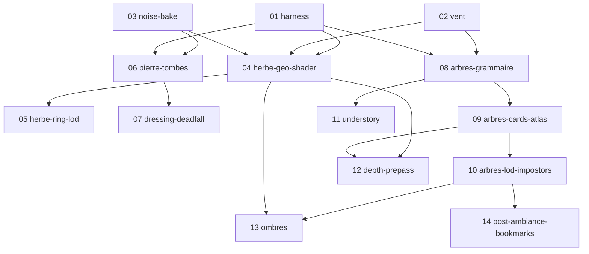

# Plan — Rework herbe + arbres/feuillage autogénérés (orchestrateur)

Inspiré de **LAAS** (`Braffolk/fable5-world-demo`, open-world procédural WebGPU) — on porte
son *esthétique* (herbe dense partout, feuillage propre autogénéré, pierre altérée, vent
vivant) dans **notre moteur WebGL**, sans casser perf ni déterminisme.

Ce dossier est fait pour un **agent orchestrateur** qui lance des **sous-agents** en
parallèle, une mission par fichier. Chaque mission est **autonome**, possède ses fichiers
(isolation worktree) et n'est *done* qu'une fois ses **critères mesurables** (Vitest + e2e
Playwright) verts.

---

## Comment l'orchestrateur travaille

1. **Lire ce README** (DAG + conventions), puis parser le bloc `yaml` en tête de chaque
   `NN-*.md` (`id` / `depends_on` / `blocks` / `parallel_with` / `owns` / `reads` / `size`).
2. **Construire les vagues** : une mission est lançable quand tout son `depends_on` est
   *done*. Les missions d'une même vague ont des `owns` **disjoints** → elles tournent en
   parallèle, chacune dans son **worktree** (`isolation: "worktree"`).
3. **Dispatcher** un sous-agent par mission avec, en prompt : le contenu du `NN-*.md` + un
   rappel des conventions ci-dessous. Le sous-agent code, écrit ses tests, et **prouve** ses
   critères d'acceptation (colle la sortie `pnpm test` + `pnpm e2e` ciblés dans son rapport).
4. **Barrière de fin de vague** : ne merger dans la branche d'intégration que les missions
   dont TOUS les critères passent + `pnpm typecheck && pnpm build` verts. Rejouer la suite
   complète après merge (détecte les conflits d'intégration).
5. **Vague suivante** quand la barrière est franchie. Mettre à jour la colonne « État » plus bas.

> **Gate d'acceptation (identique pour toutes les missions)** : `pnpm typecheck` = 0 erreur ·
> `pnpm test` (unitaires de la mission verts) · `pnpm build` OK · `pnpm e2e` (specs de la
> mission verts) · budget perf tenu · diff visuel validé vs baseline. Une mission close a
> **zéro TODO** dans son code (discipline DEVIATIONS de LAAS).

---

## DAG des missions (vagues)

| Vague | Missions (parallèles) | Pré-requis |
|---|---|---|
| **0 — Socle** | `01 harness` · `02 vent` · `03 noise-bake` | — |
| **1 — Cœurs** | `04 herbe-geo-shader` · `06 pierre-tombes` · `08 arbres-grammaire` | vague 0 |
| **2 — Extensions** | `05 herbe-ring-lod` · `07 dressing-deadfall` · `09 arbres-cards-atlas` · `11 understory` | 04 / 06 / 08 |
| **3 — Intégration** | `10 arbres-lod-impostors` · `12 depth-prepass` · `13 ombres` · `14 post-ambiance` | 09 / 04+09 / 10 |

> **Note d'ordonnancement** : la **pierre/tombes (06)** est remontée en vague 1, à égalité
> avec l'herbe — parce qu'elle touche le **cœur du jeu (#25)**, pas que le décor. Les arbres
> (décor) suivent leur propre chaîne 08→09→10 en parallèle.

## État (l'orchestrateur tient cette colonne)

| ID | Mission | Taille | État |
|---|---|---|---|
| 01 | harness | S | ✅ done (15 tests · e2e écrits, exécution déférée) |
| 02 | vent | S | ✅ done (12 tests · `scene/wind.ts`) |
| 03 | noise-bake | S | ✅ done (7 tests · `scene/noiseBake.ts`) |
| 04 | herbe-geo-shader | L | ⬜ |
| 05 | herbe-ring-lod | M | ⬜ |
| 06 | pierre-tombes | L | ⬜ |
| 07 | dressing-deadfall | M | ⬜ |
| 08 | arbres-grammaire | L | ⬜ |
| 09 | arbres-cards-atlas | L | ⬜ |
| 10 | arbres-lod-impostors | L | ⬜ |
| 11 | understory | M | ⬜ |
| 12 | depth-prepass | M | ⬜ |
| 13 | ombres | M | ⬜ |
| 14 | post-ambiance-bookmarks | M | ⬜ |

---

## Conventions (contraignantes — rappelées à chaque sous-agent)

- **Stack** : `pnpm` uniquement (jamais npm/yarn), TypeScript via **tsgo**, Three.js 0.185
  **WebGLRenderer** (pas de WebGPU/TSL — LAAS est la *référence de concept*, pas de code à copier tel quel).
- **Déterminisme** : toute génération dérive de `seededRandom` (mulberry32) + `hashSeed`
  (FNV-1a). **Jamais** de `Math.random()` dans la génération. Même graine → même sortie.
- **Clean code (CLAUDE.md)** : fichier ≤ 500 lignes, fonction ≤ 50 lignes, pas de `any`
  (préférer `unknown`), pas de magic number (const nommée en tête de module), une
  responsabilité par module, retours anticipés.
- **Three.js** : `dispose()` géométries **ET** matériaux/textures à chaque rebuild de groupe.
- **Français** partout (UI, commentaires) avec accents corrects. Échapper le HTML injecté.
- **Tests obligatoires** : logique pure → Vitest `*.test.ts` à côté du code ; visuel/perf →
  Playwright dans `e2e/`. Une régression corrigée = un test qui échouait avant.

## Infrastructure de test partagée (fournie par la mission 01, consommée par toutes)

Les missions référencent ces primitives — ne pas les réinventer :
- **URL déterministes** : `?cam=x,y,z,yaw,pitch[,fov]` · `?seed=N` · `?T=heures` · `?preset=low|high|ultra`.
- **`window.__perf`** (exposé par le moteur) : `{ drawCalls, triangles, programs, fps }` lus
  depuis `renderer.info` + delta `performance.now`. Les e2e l'`evaluate()`nt pour asserter les budgets.
- **`window.__ready`** : promesse résolue quand la scène est stable (N frames) → shot déterministe.
- **`tools/shot.ts`** : `--cam --seed --T --out foo.png` (Playwright headless).
- **`tools/compare.ts`** : diff SSIM/pixel `--a --b --out`, code retour ≠ 0 si > seuil.
- **`e2e/baselines/`** : images de référence versionnées (régénérées explicitement via `--update`).
- **Helper e2e** `shotAndDiff(cam, seed, baseline, seuil)` + `assertPerf({maxDrawCalls, minFps})`.

## Hors périmètre (assumé)

Migration WebGPU · terrain 4 km / érosion / rivières · froxels · particules GPU · GTAO/SSR
compute. Inutiles pour des cimetières bornés (voir historique dans la mémoire projet).
